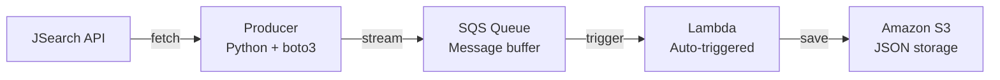

# Real-Time Job Market Intelligence Pipeline

A real-time data pipeline that streams live job postings into AWS for analysis.

## Architecture

## Tech Stack
- Python, boto3, AWS SQS, Lambda, S3, JSearch API

## How it works
1. Producer fetches live data engineering job postings from JSearch API
2. Each posting is sent as a message to an AWS SQS queue
3. Lambda automatically triggers on new SQS messages
4. Job data is stored in S3 as JSON, partitioned by date

## Setup
1. Clone the repo
2. Install dependencies: pip install boto3 requests
3. Configure AWS CLI: aws configure
4. Set environment variables for API key and SQS URL
5. Run: python producer.py
